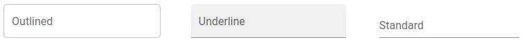
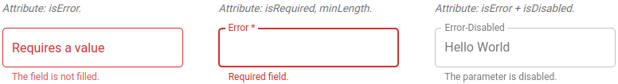
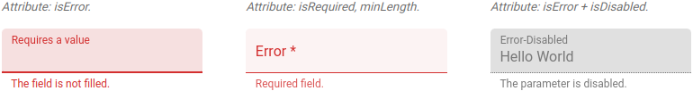
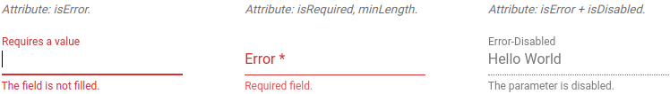
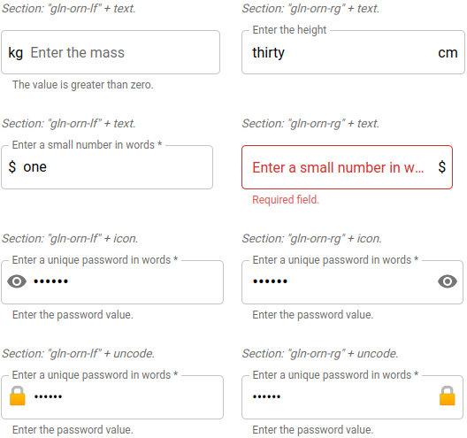
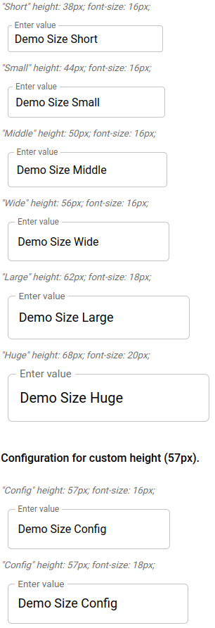
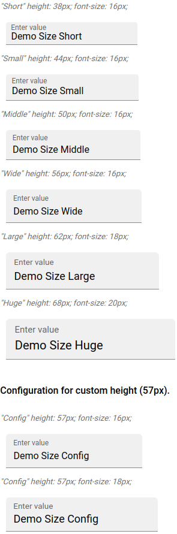
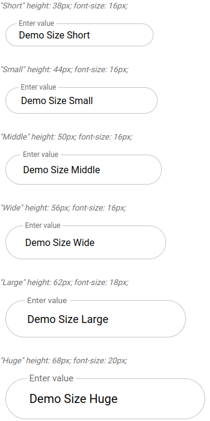
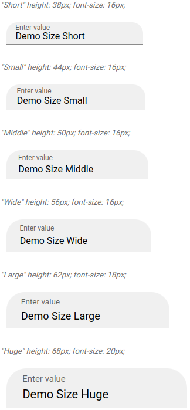

# Gelenium-UI

Library of visual components in the style of "Material UI".
But it is also more flexible.

Demo site: [gelenium-ui](https://alx-melnichuk.github.io/gelenium-ui/).
This site also has examples of use.

This library was generated with [Angular CLI](https://github.com/angular/angular-cli) version 12.2.0.

## Installation

```bash
# using npm
$ npm install gelenium-ui

# using yarn
$ yarn add gelenium-ui
```

## Component: "GlnInput"

### Basic
The GlnInput component is a form control. It includes: label, input and help text.
It comes in three versions:

- with an outline (exterior="outlined" - default)
- with a fill (exterior="underline")
- standard (exterior="standard")


                
The element's label has an animation and smoothly transitions into a placeholder.

It is possible to display an error state.

An element with an "outlined" appearance.


An element with an "underline" appearance.


An element with an "standard" appearance.


### Ornament

An ornament (text or picture) can be placed at the beginning or at the end of an element.




### Frame Size

The element's height is set according to the value of the frameSize parameter. 
All padding and offsets are determined by this variable and the font size.

The "frameSize" property takes the following values:
- "short" - sets the height to 38px;
- "small" - sets the height to 44px;
- "middle" - sets the height to 50px (default);
- "wide" - sets the height to 56px;
- "large" - sets the height to 62px;
- "huge" - sets the height to 68px;

The font size for native input and label is determined from the parent container.
The size of the font can be defined with the css-style for the "gln-input" tag.
We can change the font size at the gln-input tag level, but the height of the element will not change.

The height of the element remains the same even when the font size is changed (from font-size: 10px to 26px).

It is possible to specify the height of an element. To do this, in the "config.frameSizeValue" property, we define the required height in pixels.

An element with an "outlined" appearance.



An element with an "underline" appearance.




### Border radius

For these components, you can change the border radius.

An element with an "outlined" appearance.



An element with an "underline" appearance.



There are also other features of these components that can be seen on the demo site.
