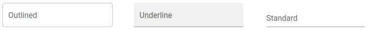

# Gelenium-UI

Library of visual components in the style of "Material UI".
But it is also more flexible.

Demo site: [gelenium-ui-demo](https://alx-melnichuk.github.io/gelenium-ui-demo/).
This site also has examples of use.

This library was generated with [Angular CLI](https://github.com/angular/angular-cli) version 12.2.0.

## Installation

```bash
# using npm
$ npm install gelenium-ui

# using yarn
$ yarn add gelenium-ui
```

## Component: "GlnInput"

### Basic
The GlnInput component is a form control. It includes: label, input and help text.
It comes in three versions:

- with an outline (exterior="outlined" - default)
- with a fill (exterior="underline")
- standard (exterior="standard")



The element's label has an animation and smoothly transitions into a placeholder.

An ornament (text or picture) can be placed at the beginning or at the end of an element.

